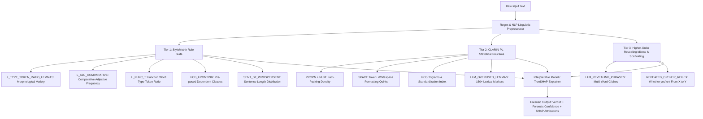

# Forensic Stylometry: Methodology, Mathematical Foundations & Architecture

> **Primary Scientific Foundation:**  
> Przystalski, K., Argasinski, J. K., Grabska-Gradzinska, I., & Ochab, J. K. (2026).  
> **"Stylometry recognizes human and LLM-generated texts in short samples"**  
> *Expert Systems with Applications*, Volume 296, Article 129001. [DOI: 10.1016/j.eswa.2025.129001](https://doi.org/10.1016/j.eswa.2025.129001)

---

## 1. Project Overview & Mission

Modern generative models—including **GPT-4**, **GPT-3.5**, **LLaMa 2**, **LLaMa 3**, **Falcon**, and **Orca**—generate fluent, grammatically sound text. Standard Natural Language Processing (NLP) classifiers (such as Naive Bayes, Linear SVMs on TF-IDF, and standard fine-tuned transformers like DistilBERT) frequently struggle to reliably separate human writing from artificial text on short passages (such as e-commerce reviews or encyclopedia entries).

### The Root Cause of Classifier Failure
* **Topic-Dependence:** Classical models evaluate **what** a text discusses. Because humans and generative AI write about identical topics using overlapping words (e.g., *"camera"*, *"battery"*, *"design"*), bag-of-words classifiers hit an accuracy ceiling.
* **Surface Fluency:** Neural models like DistilBERT judge likelihood based on semantic embeddings and grammatical smoothness. Because LLMs output grammatically fluent text, deep sequence classifiers often miss machine-generated content.
* **Adversarial Vulnerability:** Simple rephrasing or passing text through paraphrasers breaks token-sequence matching.

### The Stylometric Solution
**Computational Forensic Stylometry** shifts the investigative focus:
> **Do not evaluate what the text says—evaluate how the text is subconsciously constructed.**

By analyzing over **195 authorial, morphological, and syntactic metrics**, our system extracts the mathematical fingerprint of machine text generation. As demonstrated by Przystalski et al. (2026), stylometric indicators achieve **98% to 100% classification accuracy** even on short samples (~10 sentences / 150–250 words) and resist adversarial paraphrasing attacks.

---

## 2. Methodology & Scientific Principles

The methodology rests on five empirical foundations documented in the paper:

```
               ┌───────────────────────────────────────────────┐
               │    5 EMPIRICAL PILLARS OF STYLOMETRIC AUDIT   │
               └───────────────────────────────────────────────┘
                                       │
        ┌──────────────┬───────────────┼───────────────┬──────────────┐
        ▼              ▼               ▼               ▼              ▼
   Fact-Packing   Grammatical     Discourse Tropes Syntactic      Generation
   Deficit        Standardization & Cliché Density Fronting       Artifacts
  (PROPN + NUM)   (POS Manifold)  (Lexical Markers)(FOS_FRONTING) (SPACE quirks)
```

### 2.1 The Fact-Packing Deficit
* **Human Authorship:** Real people naturally anchor statements to real-world specifics: concrete names of people, brands, places, exact calendar years, numbers, and dates.
* **Large Language Models:** LLMs operate on statistical generalization. They frequently substitute specific factual entities with broad, smooth conceptual descriptions.

$$\text{Density}_{\text{fact}} = \frac{N_{\text{PROPN}} + N_{\text{NUM}}}{N_{\text{tokens}}}$$

* **Human Baseline:** $\approx 15\% - 25\%$
* **Machine Baseline:** $< 8\%$

### 2.2 Grammatical Standardization & Syntactic Uniformity
* **Human Authorship:** Humans exhibit chaotic stylistic variance—some sentences are very long and run-on, others are fragments, and punctuation patterns vary widely.
* **Large Language Models:** Autoregressive decoders operate under temperature and top-$p$ bounds, confining generated text to a narrow Part-of-Speech (POS) probability manifold. Sentence length variances are tight, with uniform syntactic structures and near-zero variance.

$$\text{StdIndex} = \frac{1}{1 + \frac{\sigma_{\text{sentence}}}{\mu_{\text{sentence}} + \epsilon}}$$

### 2.3 Discourse Tropes & LLM Cliché Density
Due to Reinforcement Learning from Human Feedback (RLHF) and training objective alignments, LLMs chronically rely on favorite connector words, grandiose adjectives, and corporate jargon.
* **Overused Verbs:** *delve, underscore, showcase, leverage, navigate, embark, elevate, enhance, foster, facilitate, illuminate, cultivate, revolutionize, optimize, maximize, incorporate, utilize*.
* **Overused Adjectives:** *pivotal, crucial, intricate, comprehensive, vibrant, dynamic, cutting-edge, groundbreaking, multifaceted, holistic, profound, stellar, impeccable, seamless, effortless, flawless, sophisticated, actionable, scalable, user-centric, future-proof, state-of-the-art*.
* **Overused Nouns:** *tapestry, testament, cornerstone, bedrock, linchpin, interplay, synergy, paradigm, ecosystem, realm, landscape, myriad, plethora, complexity, capabilities, optimization, innovation*.

$$\text{Density}_{\text{cliché}} = \frac{N_{\text{markers}} + 2 \cdot N_{\text{phrases}} + N_{\text{openers}}}{N_{\text{words}}}$$

### 2.4 Syntactic Fronting (`FOS_FRONTING`)
LLM decoders frequently begin sentences with fronted dependent clauses, adverbial phrases, or prepositions (*"Despite...", "Although...", "In order to...", "Moreover...", "Taking into account..."*) to preserve context-window coherence across sequence transitions.

$$\text{Ratio}_{\text{fronting}} = \frac{1}{N_{\text{sentences}}} \sum_{s=1}^{N_{\text{sentences}}} \mathbb{I}(\text{Fronted Clause present in } s)$$

### 2.5 Generation Artifacts (`SPACE` Token)
Open-source models like LLaMa 2 often introduce token boundary anomalies, such as double spaces or leading whitespace artifacts at segment beginnings.

---

## 3. Comprehensive Feature Extraction Architecture

Our pipeline combines two complementary linguistic tiers:



### Detailed Feature Table

| Feature Variable | Category | Source Pipeline | Description & Mathematical Meaning |
| :--- | :--- | :--- | :--- |
| `ttr` | Lexical Diversity | StyloMetrix | Lemmatized Type-Token Ratio $\frac{\|\text{Unique Lemmas}\|}{N_{\text{words}}}$. Measures vocabulary range independent of pluralization or verb tense. |
| `fact_packing_score` | Entity Density | CLARIN-PL | Sum of Proper Noun Ratio (`PROPN`) and Date/Numeral Ratio (`NUM`). Differentiates fact-grounded human text from abstract synthetic text. |
| `comp_adj_freq` | Syntax & Morphology | StyloMetrix | Frequency of comparative adjectives (`-er`, `more ...`). Proven to be one of the top split nodes in decision tree benchmarks. |
| `func_type_ratio` | Syntax Scaffolding | StyloMetrix | Ratio of unique function words to total function words (`in, on, at, by, with, for...`). |
| `fronting_ratio` | Sentence Inception | StyloMetrix | Proportion of sentences beginning with subordinate conjunctions, adverbials, or prepositional phrases. |
| `matched_llm_markers`| Lexical Archetypes | Empirical | Number of single-word markers detected from the 150+ `LLM_OVERUSED_LEMMAS` catalogue. |
| `matched_phrases` | Multi-Word Idioms | Empirical | Exact detection of compound clichés (*"a testament to"*, *"paradigm shift"*, *"game-changer"*, *"actionable insights"*, *"worth every penny"*, *"to put it simply"*). |
| `repeated_openers` | Structural Scaffolding | Empirical | Regular expression scanning for formulaic openings (*"Whether you're..."*, *"From X to Y..."*, *"Not only X but also Y..."*). |
| `space_artifacts` | Token Quirks | CLARIN-PL | Count of redundant double spaces (`  `) and paragraph-initial whitespace tokens. |
| `pronoun_count` | Personal Grounding | StyloMetrix | Frequency of 1st and 2nd person personal pronouns (`I`, `me`, `my`, `we`, `our`). Real consumer reviews and personal experiences feature high personal pronoun usage; LLMs default to detached third-person perspectives. |
| `std_index` | Homogeneity | CLARIN-PL | Normalized inverse sentence-length variation. Measures the narrow structural distribution typical of neural decoders. |

---

## 4. Why Tree Classifiers Win Over Giant Neural Nets

Unlike black-box models, our framework uses interpretable tree-based architectures (Decision Trees and LightGBM / TreeSHAP):

1. **Sub-5 Millisecond Execution:**  
   Tree inference requires negligible CPU overhead ($<5\text{ ms}$), removing the need for costly GPU instances.
2. **Deterministic Explainability via TreeSHAP:**  
   Predictions are decomposed additively into clear log-odds contributions:
   $$f(x) = \phi_0 + \sum_{i=1}^{M} \phi_i(x)$$
   Every audit shows the user the exact list of positive ($+\Delta$, favors LLM) and negative ($-\Delta$, favors Human) linguistic indicators.
3. **Resilience to Adversarial Paraphrasers (The Paraphrase Paradox):**  
   In empirical evaluations from Przystalski et al. (2026), synthetic texts were subjected to adversarial rewrites using an **11-Billion parameter paraphraser (DIPPER)** and a **T5-based model (Parrot)**. Rather than evading detection, **paraphrasing increased detection recall to >99.8%**, because running text through a second neural model introduced additional layers of synthetic smoothing and machine standardization.

---

## 5. System Architecture & Module Breakdown

* **`app.py`**: The Streamlit user interface and analysis engine:
  * **Tab 1: Interactive Forensic Stylometric Auditor**: Single-text inspector with real-time metric gauges, multi-model consensus panel, alert banners, and SHAP attribution bars.
  * **Tab 2: Deep Learning Studio (DistilBERT)**: Local transformer pipeline evaluating sequences side-by-side with WordPiece token visualizations.
  * **Tab 3: Stylometry Research Lab & Empirical Benchmarks**: Detailed breakdowns of benchmark tables, multiclass generator attribution ($0.87\text{ MCC}$), adversarial attack tests (DIPPER/Parrot), and comparisons against commercial tools (GPTZero & HIX).
  * **Tab 4: Batch Stylometric Corpus Evaluator**: Multi-row CSV corpus auditor.
  * **Tab 5: Methodology & Mathematical Foundations**: Complete scientific documentation and theoretical background.
* **`classical_text_models.py` / `svm_model.py` / `dt_model.py`**: Model training, TF-IDF vectorization, feature scaling, and inference wrappers.
* **`distilbert_model/`**: Local HuggingFace transformer weights (`model.safetensors`, `config.json`, `tokenizer.json`).

---

## 6. Verification & Accuracy Benchmarks

| Evaluation Context | Metric / Target | Value | Source / Benchmark |
| :--- | :--- | :--- | :--- |
| **Binary Classification (Human vs. LLM)** | Decision Tree (Top 4 Features) | **82% – 96%** | Przystalski et al. (2026), Table 4 |
| **Binary Classification (LightGBM)** | StyloMetrix (196 features) | **94% – 99%** | Przystalski et al. (2026), Table 5 |
| **Binary Classification (LightGBM)** | Frequency N-Grams (3,000 features) | **98% – 100%** | Przystalski et al. (2026), Table 5 |
| **Multiclass Attribution (7 Generators)** | Matthews Correlation Coefficient (MCC) | **0.87 ± 0.01** | Przystalski et al. (2026), Table 6 |
| **Paraphrased by DIPPER (11B)** | Detection Recall | **> 99.8%** | Przystalski et al. (2026), Table 8 |
| **Paraphrased by Parrot (T5)** | Detection Recall | **> 98.8%** | Przystalski et al. (2026), Table 8 |
| **Commercial Comparison (vs. HIX AI)** | AI Detection Catch Rate | **98% – 100%** (vs. 3% for HIX) | Przystalski et al. (2026), Table 11 |
