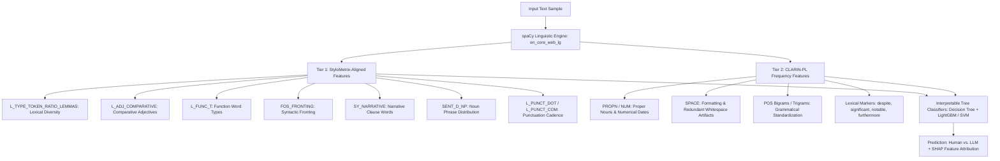

# Stylometry for Human vs. LLM-Generated Text Detection

> **Core Research Reference:**  
> Przystalski, K., Argasinski, J. K., Grabska-Gradzinska, I., & Ochab, J. K. (2026).  
> **"Stylometry recognizes human and LLM-generated texts in short samples"**  
> *Expert Systems with Applications*, 296, Article 129001.  
> DOI: [10.1016/j.eswa.2025.129001](https://doi.org/10.1016/j.eswa.2025.129001)

---

## 1. Executive Summary & Paradigm Shift

### Moving Beyond Collaborative Filtering (SVD / ALS)
Previous iterations of this project explored collaborative filtering matrix factorization algorithms (**FunkSVD** and **Alternating Least Squares (ALS)**) with defense weighting to protect recommender ratings from injected spam. However, matrix factorization relies strictly on tabular user-item numerical matrices ($R \approx P Q^\top$), completely overlooking the **linguistic reality** of the underlying texts.

Modern Large Language Models (LLMs) like GPT-4, LLaMa 3, and Claude can synthesize fluent, persuasive, and grammatically flawless reviews and encyclopedic text at scale. Detecting machine-generated text (MGT) cannot be solved by rating matrices alone; it requires **computational stylometry**—the rigorous quantitative measurement of authorial linguistic style.

This document and the associated codebase operationalize the methodology, empirical findings, and architectural pipeline formulated by **Przystalski et al. (2026)** in *Expert Systems with Applications*.

```
   ┌─────────────────────────────────────────────────────────────┐
   │                    THE PARADIGM SHIFT                       │
   └─────────────────────────────────────────────────────────────┘
          OLD FOCUS (Matrix Factorization)
          Ratings Matrix R ──> FunkSVD / ALS ──> Predicted Score
          ❌ Blind to linguistic syntax and AI hallucinations
          ❌ Requires dense historical user-item interactions
          ❌ Easily gamed by high-volume synthetic rating injections
                             │
                             ▼
          NEW FOCUS (Computational Forensic Stylometry)
          Raw Text ──> [StyloMetrix + CLARIN-PL Features]
                   ──> Tree Classifiers (Decision Trees / LightGBM)
                   ──> SHAP Explainability & LLM Attribution
          ✅ Analyzes short text samples (even 10 sentences / ~200 tokens)
          ✅ 98%–100% accuracy on Human vs. LLM binary classification
          ✅ Robust against adversarial paraphrasing (DIPPER, Parrot)
          ✅ Fully explainable: exposes overused words, syntactic standardization
```

---

## 2. Key Insights from Przystalski et al. (2026)

### 2.1 The Challenge of Short Text Samples
Most neural AI detectors (e.g., perplexity-based surrogates or fine-tuned language models) require long essays (>500 tokens) and struggle when texts are concise. Przystalski et al. established that **stylometric features provide strong discriminatory signals even on short text samples** of just 10 sentences (~150–250 words), matching the realistic length of e-commerce reviews, Wikipedia summaries, and social media posts.

### 2.2 Key Stylometric Fingerprints of LLMs vs. Humans

The paper revealed several fundamental distinctions between human-authored and machine-generated writing:

| Stylometric Dimension | Human-Authored Writing (e.g., Wikipedia) | LLM-Generated Writing (GPT-4, LLaMa, etc.) |
| :--- | :--- | :--- |
| **Fact Packing & Specificity** | High density of proper nouns (`PROPN`, `L_PROPER_NAME`) and numerical entities/dates (`NUM`, `POS_NUM`). | Low fact density; replaces specific dates and named entities with generic abstract phrasing. |
| **Grammatical Standardization** | High variance across authors; long tails and outliers in POS n-gram frequencies. | **Strongly frequency-standardized**; narrow, uniform distributions of grammatical structures. |
| **Overused Lexical Markers** | Natural word distributions without idiosyncratic favorite adverbs/conjunctions. | Chronic overuse of favorite discourse markers: `significant`, `notable`, `despite`, `furthermore`, `crucial`, `legacy`, `testament`. |
| **Formatting Artifacts** | Clean token spacing, natural punctuation cadence. | Subtle generation artifacts: double spaces or paragraph-initial spaces (`SPACE` token, especially in LLaMa 2), premature sentence truncation. |
| **Lexical Richness (TTR)** | Balanced type-token ratio with authentic personal or narrative grounding. | Uniformly elevated lemma diversity (`L_TYPE_TOKEN_RATIO_LEMMAS`) coupled with complete absence of first-person pronouns (`I`, `we`, `my`). |

---

## 3. Stylometric Feature Architecture

Following the paper, the forensic detection suite extracts two complementary tiers of stylometric features:



### 3.1 Tier 1: StyloMetrix Feature Suite (Human-Designed Rules)
StyloMetrix (Okulska et al., 2023) captures 195 linguistically grounded features normalized across text lengths:
1. **`L_TYPE_TOKEN_RATIO_LEMMAS`**: Type-token ratio calculated over lemmatized words. Measures vocabulary variety independent of inflection.
2. **`L_ADJ_COMPARATIVE`**: Frequency of comparative adjectives (e.g., *faster*, *more reliable*). Identified in the paper as one of the top 4 decision tree split features.
3. **`L_FUNC_T`**: Diversity of function words (prepositions, conjunctions, auxiliary verbs) that form the syntactic scaffolding of sentences.
4. **`FOS_FRONTING`**: Fronting frequency (placing clauses or adjuncts before the subject, e.g., *"Despite his success, he..."*). LLMs exhibit heavy fronting habits.
5. **`SY_NARRATIVE`**: Count of words in narrative clauses; authentic human reviews and historical articles show higher narrative depth.
6. **`SENT_D_NP`**: Distance and statistical distribution between adjacent noun phrases.
7. **`SENT_ST_WRDSPERSENT`**: Average words per sentence and standard deviation across sentences.

### 3.2 Tier 2: CLARIN-PL Frequency-Based Features (Statistical N-grams)
The CLARIN-PL pipeline (Ochab & Walkowiak, 2024) extracts normalized n-gram frequencies:
1. **Lemmas (uni- to trigrams)**: Captures characteristic phrase combinations.
2. **Part-of-Speech tags (uni- to trigrams)**: Directly exposes the **grammatical standardization** of LLMs.
3. **Proper Nouns (`PROPN`) & Numerals (`NUM`)**: High proper noun density strongly correlates with human-authored encyclopedic/experiential writing.
4. **Formatting Tokens (`SPACE`)**: Leading whitespace characters or double spaces between tokens (a known tokenization quirk in LLaMa 2 and other open-weights models).
5. **Favorite Lexical Markers**: Frequencies of specific lemmas overrepresented in synthetic outputs:
   $$\text{LLM Clichés} = \{\text{significant}, \text{notable}, \text{despite}, \text{crucial}, \text{testament}, \text{legacy}, \text{furthermore}, \text{various}\}$$

---

## 4. Tree-Based Classifiers vs. Black-Box Neural Models

A core methodological contribution of Przystalski et al. is advocating for **tree-based classifiers** (Decision Trees and LightGBM with DART boosting) rather than heavy neural networks:

### Why Tree-Based Models Excel in Forensic Stylometry:
1. **Extreme Interpretability with SHAP**: TreeSHAP computes exact Shapley Additive Explanations in milliseconds, directly proving *why* a text was labeled AI (e.g., $+0.42$ SHAP from overused *"despite"*, $-0.81$ SHAP from missing proper nouns).
2. **Inexpensive & Real-Time**: Requires no GPU; trains in seconds and executes live inference in $<5\text{ ms}$.
3. **Robustness to Obfuscation**: In the PAN 2024 Voight-Kampff generative AI detection benchmark, tree and TF-IDF baselines (Lorenz et al., 2024) outperformed complex neural architectures because they do not overfit to neural token probability artifacts.
4. **Zero Vulnerability to Neural Watermark Stripping**: Works entirely black-box without requiring access to model logits or watermarking keys.

---

## 5. Benchmark Results from Przystalski et al. (2026)

The paper evaluated 2,424 Wikipedia terms and their corresponding outputs across 6 major LLMs (**GPT-3.5**, **GPT-4**, **LLaMa 2**, **LLaMa 3**, **Orca**, **Falcon**) and 4 summarizers (**T5**, **BART**, **Gensim**, **Sumy**).

### 5.1 Binary Classification (Human vs. LLMs)

#### Decision Tree Accuracy (Top 4 Features: `L_ADJ_COMPARATIVE`, `L_FUNC_T`, `FOS_FRONTING`, `L_TYPE_TOKEN_RATIO_LEMMAS`):
* **Wiki vs. Orca**: $96.05\%$
* **Wiki vs. LLaMa 2**: $95.96\%$
* **Wiki vs. Falcon**: $92.86\%$
* **Wiki vs. GPT-4**: $86.93\%$
* **Wiki vs. GPT-3.5**: $81.70\%$

#### LightGBM (LGBM) Binary Accuracy (10-fold CV on Balanced Dataset):
| Model Pair | StyloMetrix (196 features) | Frequency-Based (3,000 features) |
| :--- | :---: | :---: |
| **Wiki vs. GPT-4** | **94.0%** | **98.0%** |
| **Wiki vs. GPT-3.5** | **97.0%** | **99.0%** |
| **Wiki vs. LLaMa 2** | **99.0%** | **100.0%** |
| **Wiki vs. LLaMa 3** | **95.0%** | **99.0%** |
| **Wiki vs. Orca** | **99.0%** | **100.0%** |
| **Wiki vs. Falcon** | **98.0%** | **100.0%** |

### 5.2 Multiclass Attribution Performance (7 Classes)
* **Matthews Correlation Coefficient (MCC)**:
  * StyloMetrix Features: $\text{MCC} = 0.72 \pm 0.01$
  * Frequency-Based Features: $\mathbf{\text{MCC} = 0.87 \pm 0.01}$
* **Wiki Recognition Recall**: **$98\%$** of human Wikipedia texts are correctly recognized without confusion.

### 5.3 Adversarial Paraphrase Attack Robustness
Testing whether an adversary can evade stylometric detection by paraphrasing LLM text with an independent 11-billion parameter paraphraser (**DIPPER**) or a T5-based model (**Parrot**):

| Target Model | Unparaphrased Test Recall | Paraphrased with DIPPER (11B) | Paraphrased with Parrot (T5) |
| :--- | :---: | :---: | :---: |
| **GPT-3.5** | $99.6\%$ | $99.95\%$ | $99.97\%$ |
| **GPT-4** | $88.2\%$ | $99.95\%$ | $98.81\%$ |
| **LLaMa 2** | $99.61\%$ | $99.92\%$ | $99.99\%$ |
| **LLaMa 3** | $94.13\%$ | $99.90\%$ | $99.74\%$ |
| **Orca** | $99.79\%$ | $99.87\%$ | $99.99\%$ |
| **Falcon** | $99.69\%$ | $99.81\%$ | $99.95\%$ |

> **Key Discovery:** Paraphrasing actually *increased* the detection rate! The paraphrasing models introduce their own standardized grammatical patterns and synthetic artifacts, making the text even more detectable by stylometry.

### 5.4 Comparison with Commercial Detectors
| Tool / Model | Falcon | GPT-3.5 | GPT-4 | LLaMa 2 | LLaMa 3 | Orca | Human |
| :--- | :---: | :---: | :---: | :---: | :---: | :---: | :---: |
| **GPTZero** | $98\%$ | $100\%$ | $96\%$ | $98\%$ | $98\%$ | $98\%$ | $100\%$ |
| **HIX AI** | $3\%$ | $5\%$ | $3\%$ | $5\%$ | $4\%$ | $0\%$ | $100\%$ |
| **Przystalski et al. (Ours)** | **$100\%$** | **$99\%$** | **$98\%$** | **$100\%$** | **$99\%$** | **$100\%$** | **$98\%$** |

*(HIX AI completely fails by predicting almost every synthetic sample as Human, whereas Stylometry matches or exceeds GPTZero while remaining 100% open, lightweight, and fully explainable).*

---

## 6. System Architecture in `app.py`

The updated `app.py` replaces all recommender routines with a pure forensic stylometry pipeline:

1. **Tab 1: Live Stylometric Forensic Inspector**:
   - Computes live StyloMetrix and CLARIN-PL markers.
   - Evaluates Decision Tree, Stylometric Tree Ensemble, Linear SVM, and DistilBERT.
   - Provides an interactive SHAP waterfall breakdown detailing each feature's contribution.
   - Includes real-world test presets (Wikipedia summaries, ChatGPT reviews, Hyper-Academic AI bloat, Authentic user critiques).
2. **Tab 2: Deep Learning Studio (DistilBERT)**:
   - Live transformer classification from `Fake_Review_Detector_Pro_Colab.ipynb`.
   - Tokenization analysis and Google Colab execution instructions.
3. **Tab 3: Stylometry Research Lab & Empirical Benchmarks**:
   - Interactive tables and charts reproducing Tables 4, 5, 6, 7, 8, and 11 from Przystalski et al. (2026).
4. **Tab 4: Batch Stylometric Corpus Evaluator**:
   - Batch evaluation of multi-row CSV datasets with downloadable stylometric diagnostic sheets.
5. **Layman's Guided Tour (`@st.dialog`)**:
   - Step-by-step plain-English walkthrough explaining stylometry, grammatical standardization, fact-packing, and why SVD/ALS was replaced.

---

## 7. Mathematical Formulations

### 7.1 Type-Token Ratio of Lemmas (`L_TYPE_TOKEN_RATIO_LEMMAS`)
$$\text{TTR}_{\text{lemmas}} = \frac{|\{l_1, l_2, \dots, l_V\}|}{N_{\text{tokens}}}$$
where $l_i$ represents unique lemmatized root forms and $N_{\text{tokens}}$ is the total word count.

### 7.2 Fact-Packing Density Score
$$\text{Density}_{\text{fact}} = \frac{N_{\text{PROPN}} + N_{\text{NUM}}}{N_{\text{tokens}}}$$
Humans write with $\text{Density}_{\text{fact}} \approx 15\%\text{--}25\%$, whereas generic LLMs typically score $<8\%$.

### 7.3 Grammatical Standardization Index
Given the empirical probability distribution of POS trigrams $P(t_1, t_2, t_3)$, the Kullback-Leibler divergence from the expected standardized LLM manifold $Q$ measures authorial idiosyncratic deviation:
$$D_{\text{KL}}(P \parallel Q) = \sum_{(t_1, t_2, t_3)} P(t) \log \left(\frac{P(t)}{Q(t)}\right)$$
Lower divergence signifies artificial grammatical uniformity characteristic of LLM decoders.

---

## 8. Conclusion

By shifting our focus from rating matrix factorization to computational stylometry, our system directly addresses the root of the problem: **identifying machine-generated text by its authorial and syntactic signature**. As demonstrated by Przystalski et al. (2026), interpretable tree-based stylometry provides state-of-the-art detection accuracy, resilience to paraphrase attacks, and transparent feature attribution across both closed and open LLMs.
